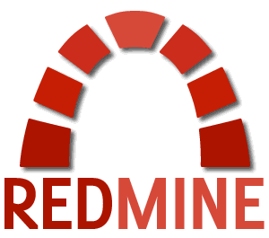

# Sumac

   :rocket:  :raised_hands: :pray: :point_right: :satellite: :soon:  

A simple command line utility for pulling Harvest entries and pushing them into Redmine. Harvest, Redmine, a red harvest... sumac.

How does it work? Log a time entry in Harvest and say "Worked on issue #123".

## Running with Docker (recommended)

#### In production

You do not need to clone the repo in production. Instead pull the `savaslabs/sumac` image from docker hub and run it. Create a new blank directory and populate it with a `config.yml` file, using the example in `config.example.yml`.

Run `docker run --rm -v $(pwd):/tmp/sumac savaslabs/sumac sync -c /tmp/sumac/config.yml -u 20160915:20160916` (or whatever other date range). Add `--dry-run` to test.

#### For local development

Spin up redmine locally.

Copy `config.example.yml` to `config.yml` and fill in any values (particularly, you'll need the Slack webhook URL if you want to test slack integration). You'll also need to fill in some harvest credentials which have the proper permissions.

Within the `sumac` directory, run `docker run --net redmine_default -it --rm -v $(pwd):/usr/src/sumac savaslabs/sumac sync -u 20160915:20160916`.

Adjust the `--net redmine_default` parameter to match the network your Redmine instance is running on  (use `docker network ls` to find the correct value).

If you are developing, you'll want to run `composer install` on the host, to get grumphp and phpcs locally.

## Requirements

- Redmine 3
- Admin access to Harvest and Redmine
- PHP pspell package installed locally (for non-docker usage)
- Composer locally (for non-docker usage)

Please use the `--dry-run` option to confirm changes. Always back up your database before running. Things might break.

## Usage

### Standalone

You can also run the app on its own with a bit more granularity. For example, pass in an argument like `20150101:20151208` to sync all entries from Jan 1, 2015 to Dec 8, 2015.

#### Options

You may also use the `--dry-run` flag to not actually post any data to Redmine.

Use the `--update` option if you'd like to make updates to existing Redmine time entries. This is helpful if a user has gone back into Harvest and adjusted wording for Redmine issue descriptions, or time amounts, etc.

### Redmine and Harvest Authorization

Fill in your credentials for Harvest and Redmine. The user account should have admin privileges to both systems.

### Redmine configuration

Sumac will look for a custom redmine project field called `Harvest Project ID(s)`, and use the values of that field to populate the mapping between Redmine projects and Harvest projects. You'll need to create this field if it doesn't exist, and also populate it for each project which you want to sync properly.

### Sync settings

#### Projects

You can use the `exclude` section to add the Harvest IDs for projects that you don't want to push time entries to. This is helpful for "Internal" or "Overhead" projects that you don't need to sync with Redmine projects.
